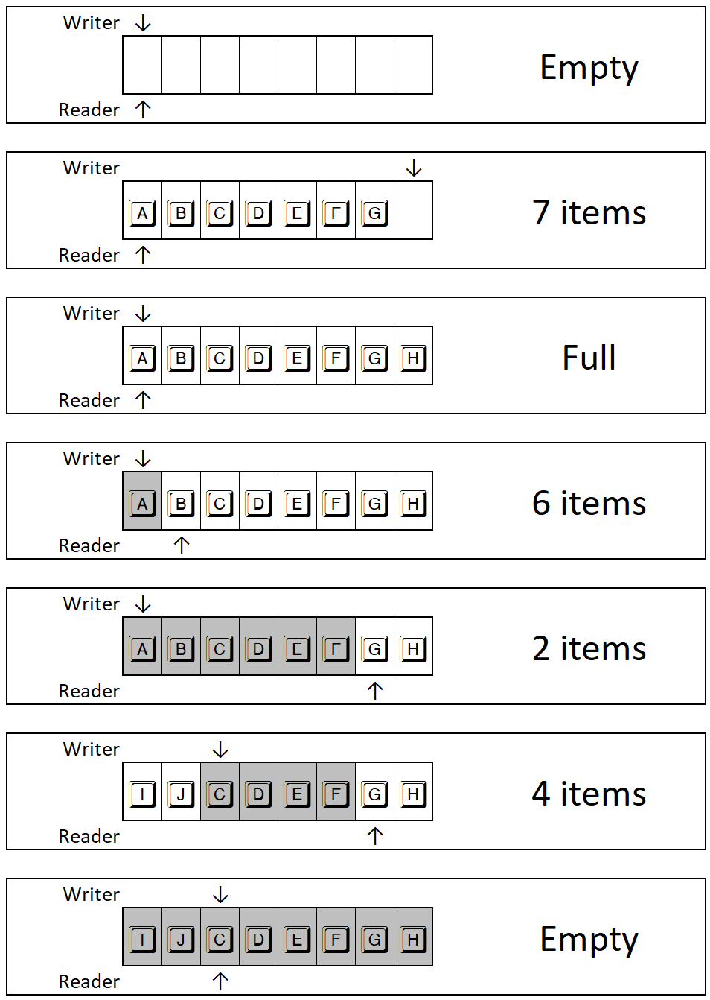
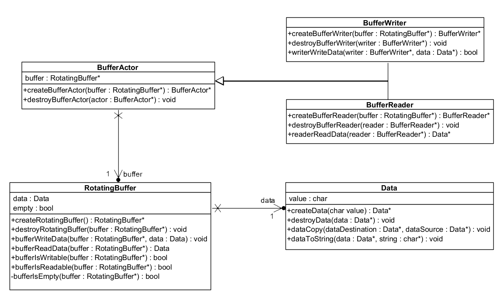

# Generic Rotating Buffer made by JAD

## Objectif de ce Kata

L'objectif est de fournir un composant de buffer circulaire.

Imaginez le buffer de votre clavier. La mémoire tampon du clavier est statique. C'est une puce
contenant quelques octets de mémoire. Cette mémoire n'est pas dynamique, le nombre de touches
pouvant être stockées avant traitement par l'ordinateur est donc fini. Vous avez déjà peut-être eu
le cas où votre clavier émet un bip si vous tapez trop de touches (au démarrage de l'ordi par
exemple). C'est une manière pour le poste de vous prévenir que sa mémoire tampon est pleine et que
toutes les touches que vous saisissez ne sont pas prises en compte.

Dans le cas d'un clavier d'ordinateur, le système émetteur (vous qui tapez sur le clavier) et le
récepteur (l'ordi qui doit traiter les touches) sont totalement asynchrones. Vous nêtes pas soumis à
la même temporalité que l'ordinateur. La mémoire tampon du clavier doit donc être accessible en
lecture et en écriture en même temps. De plus, un tableau classique ne serait pas efficace. En
effet, si vous avez rempli toute la mémoire tampon, vous devrez attendre que toutes les touches
aient été traitées par l'ordinateur (et que la mémoire soit vide) pour commencer à le
re-remplir. Il serait plus intéressant de re-remplir le tableau au début (à partir des touches déjà
traitées par l'ordi).

C'est ce que l'on appelle un buffer circulaire. C'est un tableau qui se remplit de manière
circulaire. Une petite image pour illustrer le fonctionnement :

## Rotating Buffer - Principe

Le buffer circulaire est un tableau de taille fixe.

Il est composé de deux indices :

- un indice de lecture
- un indice d'écriture

Pour rendre le fonctionnement efficace, il vaut mieux sous-traiter la lecture et l'écriture.

## Voici le diagramme de classe de la situation initiale :

Les classes correspondent à des structures de données.

Le buffer actuel est d'une taille de 1 élément.

## Travail à réaliser

Pour le moment étant donné que le buffer est d'une taille de 1 élément, aucun algorithme de rotation n'est nécessaire.
Vous allez devoir modifier la taille du buffer pour qu'il puisse contenir 10 éléments.

1. Modifier la structure de données RotatingBuffer pour qu'elle puisse contenir 10 éléments.
2. Ajouter des attributs indexWriter et indexReader à la structure de données RotatingBuffer.
3. Modifier la fonction createRotatingBuffer pour qu'elle initialise les attributs indexWriter et indexReader à 0.
4. Modifier la fonction writeRotatingBuffer pour qu'elle écrive un élément dans le buffer à l'index indexWriter.
5. Modifier la fonction readRotatingBuffer pour qu'elle lise un élément dans le buffer à l'index indexReader.
6. Modifier les fonctions bufferIsEmpty(), bufferIsReadable() et bufferIsWritable() et créer bufferIsFull() pour
   qu'elles prennent en compte ces deux nouveaux index.
7. Normalement, magie !!! tout fonctionne.

